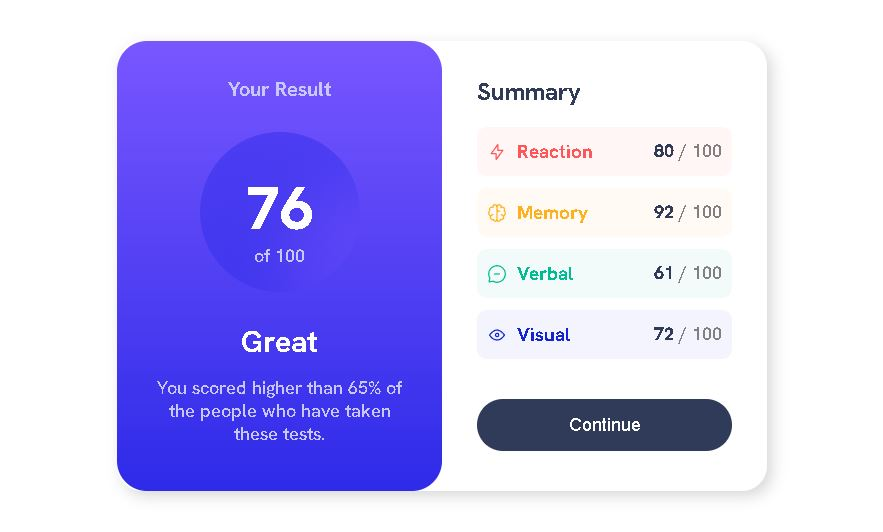

# Frontend Mentor - Results summary component solution

This is a solution to the [Results summary component challenge on Frontend Mentor](https://www.frontendmentor.io/challenges/results-summary-component-CE_K6s0maV). Frontend Mentor challenges help you improve your coding skills by building realistic projects. 

## Table of contents

- [Overview](#overview)
  - [The challenge](#the-challenge)
  - [Screenshot](#screenshot)
  - [Links](#links)
  - [My process](#my-process)
  - [Built with](#built-with)
  - [What I learned](#what-i-learned)
- [Author](#author)

## Overview

This challenge relies mainly on the capacity to understand linear-gradient and add neomporhism to create the circle element.

### The challenge

Users should be able to:

- View the optimal layout for the interface depending on their device's screen size
- See hover and focus states for all interactive elements on the page

### Screenshot

### Links

- Solution URL: [https://ebaroth.github.io/Frontend-Mentor---Results-summary-component/]

## My process

Classic process, HTML then CSS (reset, root, then all the components to end with media queries).

### Built with

- Semantic HTML5 markup
- CSS custom properties
- Flexbox

### What I learned

This challenge really helped me deal with responsive elements that completely change their place and behaviour. Also learnt to deal with linear-gradient, opacity...

## Author

- Frontend Mentor - [@eBaroth](https://www.frontendmentor.io/profile/eBaroth)

